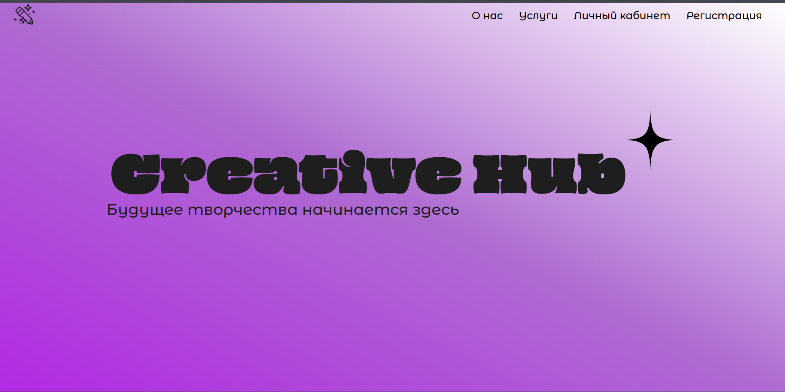
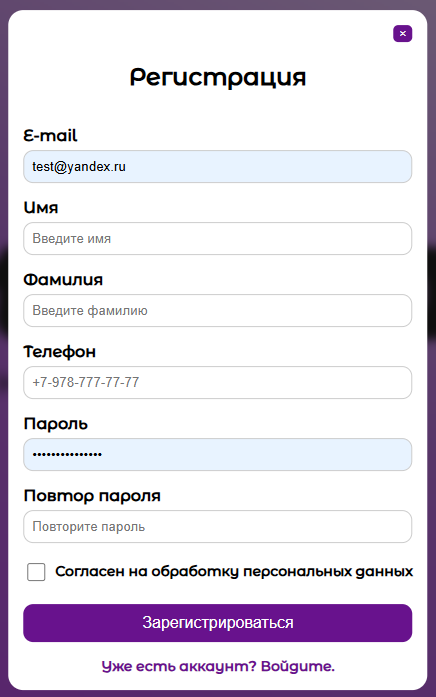
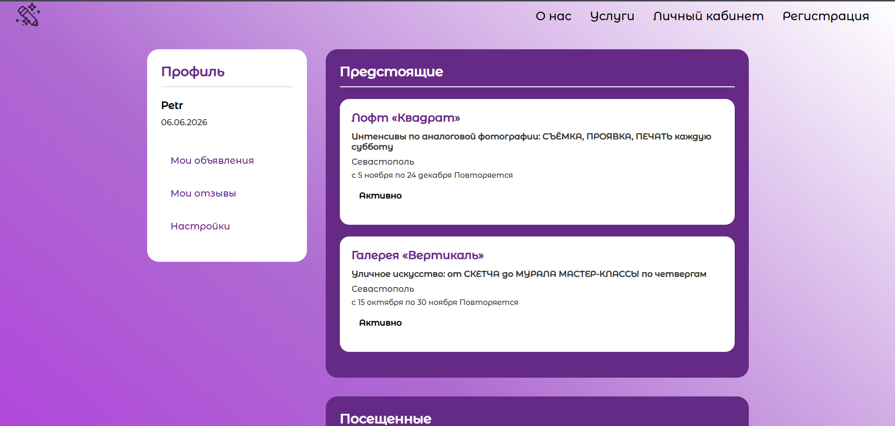

# Creative Hub - Веб-платформа для творческих людей

## О проекте
**Creative Hub** — это учебный пет-проект, разработанный для демонстрации навыков веб-разработки. Это многостраничный сайт с системой регистрации и авторизации пользователей, личным кабинетом и динамическим контентом.

Проект создавался с акцентом на:
- Безопасность (хеширование паролей, защита от SQL-инъекций)
- Чистую архитектуру (разделение логики, шаблонов и обработчиков)
- Пользовательский опыт (валидация форм с выводом понятных ошибок)

---

## Технологический стек
| Компонент | Технологии |
|-----------|------------|
| **Фронтенд** | HTML5, CSS3 (Flex/Grid, адаптив), JavaScript |
| **Бэкенд** | PHP (обработка форм, сессии, валидация) |
| **База данных** | PostgreSQL / MySQL (подготовленные запросы) |
| **Инструменты** | Git, GitHub, XAMPP / OpenServer |

---

## Функциональные возможности
- Регистрация новых пользователей с валидацией полей
- Авторизация с проверкой email и пароля
- Личный кабинет с отображением данных пользователя
- Защита страниц от неавторизованного доступа
- Динамическое отображение ошибок (без перезагрузки страницы)

---

## Скриншоты

---

## Установка и запуск
1. **Клонируйте репозиторий:**
   git clone https://github.com/Raz0Rz/Creative_Hub.git

2. **Настройте базу данных**:
    Импортируйте файл database/users.sql в вашу СУБД (PostgreSQL или MySQL)
    Создайте базу данных и настройте подключение в includes/db.php

3. **Запустите сервер**:

Используйте XAMPP, OpenServer или встроенный PHP-сервер

## Структура проекта:

Creative_Hub/
├── index.php          # Главная страница
├── about.php          # Страница "О нас"
├── services.php       # Страница услуг
├── lk.php             # Личный кабинет
├── login.php          # Страница входа
├── register.php       # Страница регистрации
├── handlers/          # Обработчики форм (регистрация, вход)
├── includes/          # Подключения к БД, проверка авторизации
├── database/          # SQL-схемы таблиц
├── Allstyle/          # Стили и скрипты (CSS, JS)
└── images/            # Изображения для сайта

## Контакты
Автор: [Андрей]

GitHub: Raz0Rz

Telegram: @ToxaAndr
VK: https://vk.com/adubovoy2013

